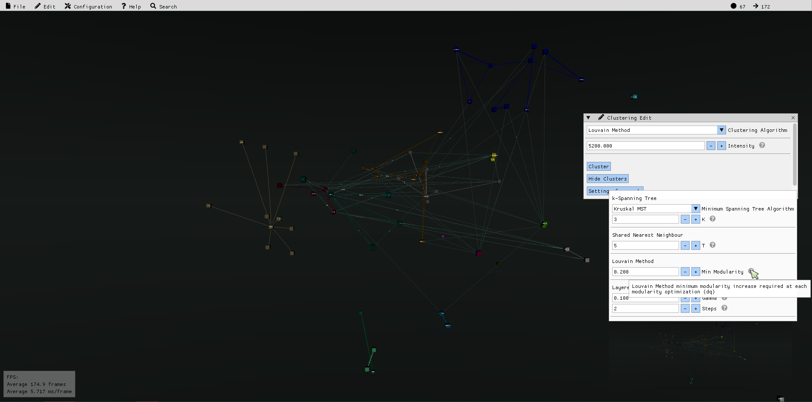

# A 3D visualizer of software architectural dependencies 


## Summary 

**Archv** (Architecture visualizer) is a tool for visualizing C++ 
object-oriented, software architectural dependencies taken from global symbol
tables, in the form of a 3D graph.


## Features

| 3D Graph rendering | Dynamic illumination
|----|----|
|  |  |

| Class Metadata inspection | Procedural edge-curve generation
|----|----|
|  |  |

| Layout & topology editing | Edge weight editing
|----|----|
|  |  |

| Vertex dynamic scaling according to class metadata | Clustering
|----|----|
|  |  |

| Particle system effects depending on vertex in/out degrees | Extensive configuration
|----|----|
|  |  |


## Third-Party Dependencies

* GoogleTest  
https://github.com/google/googletest
* Boost Graph Library (BGL)  
https://www.boost.org/doc/libs/1_80_0/libs/graph/doc/index.html
* Boost Signals2  
https://www.boost.org/doc/libs/1_61_0/doc/html/signals2.html
* Boost Log v2  
https://www.boost.org/doc/libs/1_63_0/libs/log/doc/html/index.html
* Boost Exception  
https://theboostcpplibraries.com/boost.exception
* Jsoncpp  
https://github.com/open-source-parsers/jsoncpp
* Infomap  
https://github.com/mapequation/infomap
*  IconFontCppHeaders  
https://github.com/juliettef/IconFontCppHeaders
* SDL  
https://github.com/libsdl-org/SDL
* OpenGL
* Freetype  
https://github.com/freetype/freetype
* Stb  
https://github.com/nothings/stb
* Dear ImGui  
https://github.com/ocornut/imgui
* OGRE v13  
https://github.com/OGRECave/ogre
* OGRE Bites Component
* OGRE Overlay Component
* Ogre Procedural


## Set-Up / Build

Archv uses CMake as its build system on all supported platforms (tested on 
ubuntu debian Pop!_OS version 22.04 LTS). This guide will explain to you how to
use CMake to build Archv from source, under this OS.

### Getting dependencies

* GoogleTest  
(This dependency can be skipped if you do not wish to build the Archv tests.)  
Download the v1.12.1 release from: https://github.com/google/googletest.
You should now create a build directory for GTest somewhere outside GTest's
sources.  
Then:  
`cd build && cmake ..`  
`make`  
`sudo make install`  
Archv should now be able to locate a CMake configuration file for GTest.  If 
not, the path to the directory containing the CMake configuration file must be 
given to CMake with the CMake variable: GTest_DIR 

* Boost  
`sudo apt-get install libboost-all-dev`  
This will install all of the required Boost modules (Graph, Signals2, Log, 
Exception).  If a compile/linking error occurs when building Archv from source,
make sure that the CMake variables: Boost_INCLUDE_DIR, Boost_LOG_LIBRARY_RELEASE
, Boost_LOG_SETUP_LIBRARY_RELEASE and Boost_PROGRAM_OPTIONS_LIBRARY_RELEASE are
configured appropriately 

* Jsoncpp  
`sudo apt-get install libjsoncpp-dev`  
This will install the compatible JsonCpp library on your system. Archv should 
now be able to link against the libjsoncpp target.  

* Infomap  
This dependency is being used as a git submodule 
(see https://git-scm.com/book/en/v2/Git-Tools-Submodules) and will be fetched 
and built from source when building the Archv application. (see [Set-Up](#set-up)).

* IconFontCppHeaders  
This dependency is being used as a git submodule 
(see https://git-scm.com/book/en/v2/Git-Tools-Submodules) and will be fetched 
and built from source when building the Archv application. (see [Set-Up](#set-up)).

* SDL  
`sudo apt-get install libsdl2-dev`  
This is also an Ogre dependency. 
(see https://ogrecave.github.io/ogre/api/1.12/building-ogre.html).  
This will install the compatible SDL library on your system.  Archv should 
now be able to link against the libSDL2 target.  

* OpenGL  
`sudo apt-get install libgles2-mesa-dev`  
This is an Ogre dependency. 
(see https://ogrecave.github.io/ogre/api/1.12/building-ogre.html).  
Archv should now be able to locate a CMake configuration file for OpenGL. 

* Freetype  
See: https://github.com/freetype/freetype/blob/master/docs/INSTALL.UNIX  
Clone the repo from: https://github.com/freetype/freetype.  
`git clone https://github.com/freetype/freetype`  
You should now create a build directory for Freetype somewhere outside
Freetype's sources.  
Then:  
`cd build && cmake ..`  
`make`  
`sudo make install`  
Archv should now be able to locate a CMake configuration file for Freetype. If 
not, the path to the directory containing the CMake configuration file must be 
given to CMake with the CMake variable: FreeType_DIR 

* Stb  
`sudo apt install libstb-dev`  
This will install the compatible stb library on your system. Archv should 
now be able to link against the libstb target.  

* Dear ImGui  
Just clone the repo from: https://github.com/ocornut/imgui somewhere.  
`git clone https://github.com/ocornut/imgui`  
The build  process of the Ogre Overlay component will take care of the rest.

* OGRE  
See: https://ogrecave.github.io/ogre/api/1.12/building-ogre.html.  
Download a v13 release from: https://github.com/OGRECave/ogre.  
You should now create a build directory for Ogre somewhere outside
Ogre's sources.  
Then:  
`cd build`  
Archv makes use of the Bites & Overlay components, so be sure to build them as
well. Thus the CMake variables: OGRE_BUILD_COMPONENT_BITES, 
OGRE_BUILD_COMPONENT_OVERLAY, OGRE_BUILD_COMPONENT_OVERLAY_IMGUI, 
OGRE_BUILD_DEPENDENCIES must be set to: TRUE. Also, make sure the CMake variable
IMGUI_DIR is set to the directory path of the imgui headers.  
The rest of Ogre's settings can be configured as you wish.  
(Tip: use the cmake-gui tool here, see: 
https://cmake.org/cmake/help/latest/manual/cmake-gui.1.html).  
`make`  
`sudo make install`  
Archv should now be able to locate a CMake configuration file for Ogre. If 
not, the path to the directory containing the CMake configuration file must be 
given to CMake with the CMake variable: OGRE_DIR 

* Ogre Procedural  
This is a dependency that is not packaged with Ogre from the previous step.  
Clone the repo from: https://github.com/OGRECave/ogre-procedural.  
`git clone https://github.com/OGRECave/ogre-procedural`  
You should now create a build directory for  Ogre Procedural somewhere outside
 Ogre Procedural's sources.  
Then:  
`cd build && cmake ..`  
(But make sure that the CMake variable: OGRE_DIR is set to the directory path 
containing a CMake configuration file for Ogre).  
`make`  
`sudo make install`  
Archv should now be able to locate a CMake configuration file for Ogre 
Procedural.  If  not, the path to the directory containing the CMake 
configuration file must be given to CMake with the CMake variable: 
OGRE_PROCEDURAL_DIR 


### CMake optional variables

Before building the application, some final CMake variables can optionally be
set. Namely, the: ARCHV_CONFIG_DIR, ARCHV_RENDERING_CONFIG_PATH, 
ARCHV_GUI_CONFIG_PATH,  ARCHV_WEIGHTS_CONFIG_PATH, ARCHV_LAYOUT_CONFIG_PATH, 
ARCHV_SCALING_CONFIG_PATH, ARCHV_CLUSTERING_CONFIG_PATH, ARCHV_RESOURCE_GROUP.  
The ARCHV_CONFIG_DIR CMake variable must be set to the directory path containing
all of the .json runtime configuration files. (E.g. path/to/archv/data/config).  
The ARCHV_RENDERING_CONFIG_PATH, ARCHV_GUI_CONFIG_PATH, 
ARCHV_WEIGHTS_CONFIG_PATH, ARCHV_LAYOUT_CONFIG_PATH, ARCHV_SCALING_CONFIG_PATH, 
ARCHV_CLUSTERING_CONFIG_PATH CMake variables must be set in order to specify the
file path(s) to the .json configuration file(s) for each Archv subsystem.
(see [Configuration](#configuration)).  
The ARCHV_RESOURCE_GROUP CMake variable is the resource group name used by Archv
in order for Ogre to locate its assets. (see Configuration Files section at: 
https://ogrecave.github.io/ogre/api/1.12/setup.html).


### Notes

Archv makes use of several C++20 library features (input range adaptors), 
thus certain compilers that do not support these features will fail to build 
this project (like Clang libc++).  
(see https://en.cppreference.com/w/cpp/compiler_support).  
Archv has been tested with GCC libstdc++.


### Building

You should create a build directory for Archv somewhere outside Archv's sources.  
Then:  
`cd build && cmake ..`  
`make`  
`make archv_app`  
`make archv_tests`  
In order to build all targets, the application, or the tests respectively.


### Set-Up

Lastly, before attempting to run the application, the directory paths of all of
the used assets must be specified for Ogre, under the Archv resource group name.  
Add the following lines to your resources.cfg file: (probably located under: 
/usr/local/share/OGRE)  
```cfg
[<Archv resource group name>]
FileSystem=/path/to/archv/data/textures
FileSystem=/path/to/archv/data/materials
FileSystem=/path/to/archv/data/models
FileSystem=/path/to/archv/data/fonts
FileSystem=/path/to/archv/data/particles   
```
(See Configuration Files section at: 
https://ogrecave.github.io/ogre/api/1.12/setup.html).

> **_NOTE:_**  If the Archv resource group name has not been manually specified,
it will be defaulted to: 'Archv'. (see [CMake optional variables](#cmake-optional-variables)).  

## Usage

The visualizer uses the output .json file from the GraphGenerator project 
(see forked/updated repo) https://github.com/SoultatosStefanos/Code-Smell-Detector
as command line input.

E.g. `./archv_app foo/bar/buzz/graph.json`  

Or, in order to run the tests:  

`./tests/archv_tests`


## Configuration


