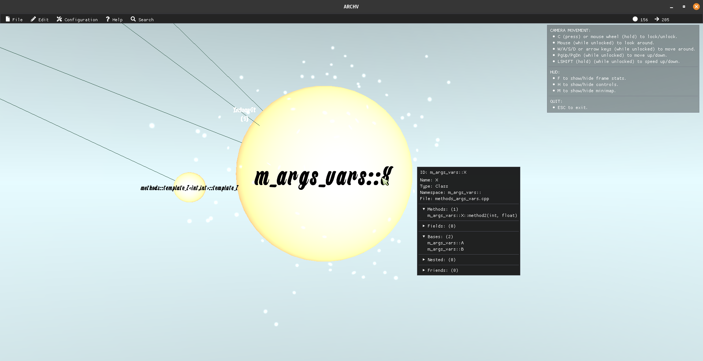

# A 3D visualizer of software architectural dependencies

## Summary

**Archv** (Architecture visualizer) is a tool for visualizing C++
object-oriented, software architectural dependencies taken from global symbol
tables, in the form of a 3D graph.

## Table of Contents

[Features](#features)  
[Set-Up / Build](#set-up--build)  
[Usage](#usage)  
[Configuration](#configuration)

## Features

| 3D Graph rendering                 | Dynamic illumination                           |
| ---------------------------------- | ---------------------------------------------- |
|  |  |

| Class Metadata inspection                       | Procedural edge-curve generation                 |
| ----------------------------------------------- | ------------------------------------------------ |
|  |  |

| Layout & topology editing                           | Edge weight editing                           |
| --------------------------------------------------- | --------------------------------------------- |
|  |  |

| Vertex dynamic scaling according to class metadata   | Clustering                           |
| ---------------------------------------------------- | ------------------------------------ |
|  |  |

| Particle system effects depending on vertex in/out degrees | Edge dependencies color coding         |
| ---------------------------------------------------------- | -------------------------------------- |
|                  |  |

| Extensive rendering configuration                 | Extensive resource configuration                   |
| ------------------------------------------------- | -------------------------------------------------- |
|  |  |

## Third-Party Dependencies

- GoogleTest  
  https://github.com/google/googletest
- Boost Graph Library (BGL)  
  https://www.boost.org/doc/libs/1_80_0/libs/graph/doc/index.html
- Boost Signals2  
  https://www.boost.org/doc/libs/1_61_0/doc/html/signals2.html
- Boost Log v2  
  https://www.boost.org/doc/libs/1_63_0/libs/log/doc/html/index.html
- Boost Exception  
  https://theboostcpplibraries.com/boost.exception
- Jsoncpp  
  https://github.com/open-source-parsers/jsoncpp
- Infomap  
  https://github.com/mapequation/infomap
- IconFontCppHeaders  
  https://github.com/juliettef/IconFontCppHeaders
- SDL  
  https://github.com/libsdl-org/SDL
- OpenGL
- Freetype  
  https://github.com/freetype/freetype
- Stb  
  https://github.com/nothings/stb
- Dear ImGui  
  https://github.com/ocornut/imgui
- OGRE v13  
  https://github.com/OGRECave/ogre
- OGRE Bites Component
- OGRE Overlay Component
- Ogre Procedural

## Set-Up / Build

Please read
[`build.md`](https://github.com/SoultatosStefanos/archv/blob/master/docs/build.md)
for details on how to setup/build this project.

## Usage

The visualizer uses the output .json file from the GraphGenerator project
(see forked/updated repo) https://github.com/SoultatosStefanos/Code-Smell-Detector
as command line input.  
Additionally, a .json configuration file must be specified.

E.g. `./archv_app foo/bar/buzz/graph.json zoo/buzz/myconfig.json`

Or, in order to run the tests:

`./tests/archv_tests`

## Configuration

Please read
[`configuration.md`](https://github.com/SoultatosStefanos/archv/blob/master/docs/configuration.md)
for details on how to configure this project for your needs.
